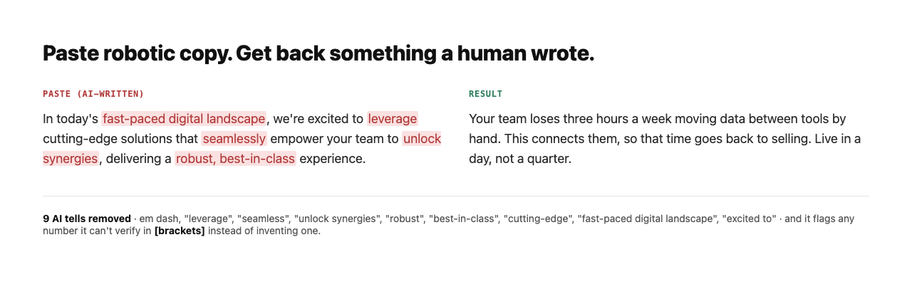

# AI Marketing Skills

Eight small, sharp AI skills for the jobs a B2B marketing leader actually hands to a model every week: sharpen positioning, define an ICP, tear down a competitor, plan demand, write outreach worth replying to, turn one idea into a week of content, build a case study from a real win, and strip the robot out of your copy.



*The real before/after this skill produces, shown plainly - not a decorative mockup.*

> **Before:** In today's fast-paced digital landscape, our cutting-edge solution empowers teams to seamlessly unlock their full potential and drive unparalleled growth.
>
> **After:** Your team already knows what's broken. This gets it fixed in a week, not a quarter, and shows you the number that moved.

*`anti-robot-editor`, the most-used skill, on a line of real AI slop: same length, none of the tells.*

## What it does

- Turns the weekly marketing jobs into repeatable prompts: positioning, ICP, competitive teardowns, demand plans, cold email, and content.
- Strips AI tells out of any copy so it reads like a specific human, not a model.
- Refuses to fake specificity. Where a claim needs a real number, the skill flags it in `[brackets]` instead of inventing one, and it never uses em dashes.
- Works anywhere. Each skill is plain instructions, so it runs as a Claude Code skill, a Custom GPT, a system prompt, or a pasted prompt in any model.

## The skills

| Skill | What it does |
|---|---|
| `anti-robot-editor` | Strips AI tells out of copy so it sounds like a specific human. The most-used one. |
| `positioning-in-five-seconds` | A one-line positioning statement a busy buyer gets in five seconds, plus two angles and their trade-offs. |
| `icp-from-best-customers` | Turns your best accounts into a sharp ICP and a "not a fit" list, using only real patterns. |
| `competitive-teardown` | Reads a competitor's messaging and hands you three wedges they cannot easily copy. |
| `first-demand-plan` | A lean, opinionated first-90-days demand plan for a real budget and a small team. |
| `cold-outreach` | A cold email a busy buyer would actually reply to, in two versions. |
| `content-engine` | Stretches one real insight into a week of content without watering it down. |
| `case-study-from-a-win` | Turns one real customer win into a credible case study, inventing no numbers or quotes. |

## Install

Clone the repo, then copy the skills you want into your skills directory:

```bash
git clone https://github.com/brittanyslay/marketing-skills.git
cd marketing-skills

# user-level (available in every project)
mkdir -p ~/.claude/skills
cp -r skills/* ~/.claude/skills/

# or project-level (just this project)
mkdir -p .claude/skills
cp -r skills/* .claude/skills/
```

Then invoke a skill by name, or just describe the task and let Claude pick it up. Each skill lives in `skills/<name>/SKILL.md` with YAML frontmatter, the standard Claude Code format.

To use them anywhere else, open any `SKILL.md`, copy the body, and paste it into ChatGPT, Claude, Gemini, or a Custom GPT's instructions. They are model-agnostic. Swap the `[BRACKETED]` parts for your own details.

## Example prompts

Plain-language ways to reach for these skills. Say the task and the right skill picks it up.

- `rewrite this so it doesn't sound like AI`
- `edit this landing page copy to sound like a real person wrote it`
- `give me a one-line positioning statement a buyer gets in five seconds`
- `turn our best customers into an ICP and a not-a-fit list`
- `tear down [competitor]'s homepage messaging and find angles they can't copy`
- `plan my first 90 days of demand gen on a small budget`
- `pick the 2-3 channels that actually work for a $[X]k deal size`
- `write a cold email a CFO would actually reply to`
- `turn this insight into a week of LinkedIn posts`
- `stretch one idea into a post, a longer piece, and replies without watering it down`
- `write a case study from this customer win without making up any numbers`
- `turn this before-and-after result into a credible customer story`

## The one rule that runs through all of them

Do not fake specificity. If a claim needs a real number, these skills flag it in `[brackets]` for you to fill in rather than inventing one. And no em dashes, anywhere.

## License

Noncommercial use only (PolyForm Noncommercial 1.0.0). Commercial use requires a license from Brittany Slay. See [LICENSE.md](LICENSE.md). Use, adapt, and share these skills for noncommercial purposes with attribution to Brittany Slay intact.

---

Built by [Brittany Slay](https://brittanyslay.com), a B2B marketing leader who builds AI-native tools. More free Claude skills at [brittanyslay.com/skills](https://brittanyslay.com/skills). Want a GTM build, a demand engine, or an AI-native marketing function built for real? [Get in touch](https://brittanyslay.com/#contact).
